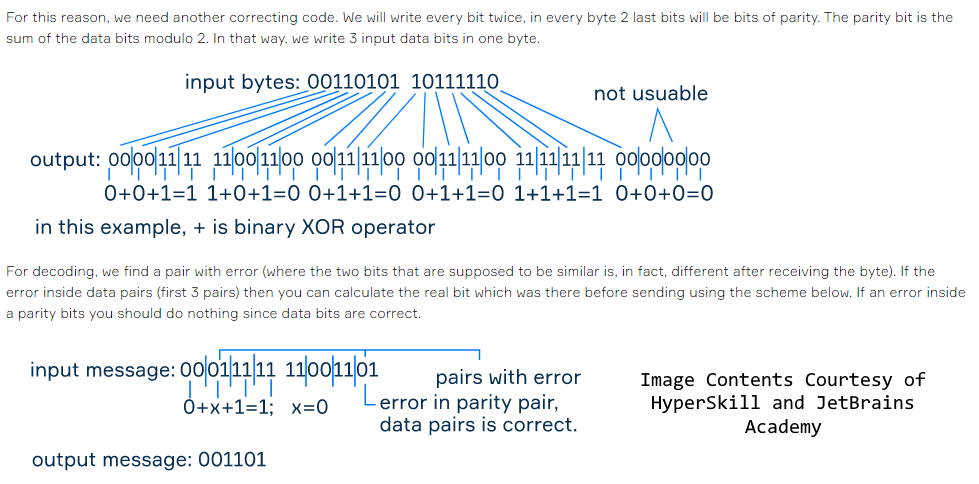

# Error Correcting Encoder/Decoder

This project works closely with binary numbers and bytes. Using bit
operations, this program can encode the given "send.txt" file to a
format that can handle up to one bit errors.

The program uses two Encoding/Decoding/Correcting techniques,
Hamming Codes and Double-Bit. It features random error simulation
and can print out the binary and hexadecimal representations at each
stage to help visualize the process.

Find more about Hamming codes
[here](https://en.wikipedia.org/wiki/Hamming_code)

I couldn't find much information on Double-Bit Encoding so here is
an infographic (Also in the Repo)

## Instructions

- Ensure a "send.txt" message is in the root directory
- Compile/Build the Main.java (with Javac or your IDE)
- Run the Main class (with Java or your IDE)
- Run encode, send, and decode in that order (Follow Further 
Instructions in the CLI)
